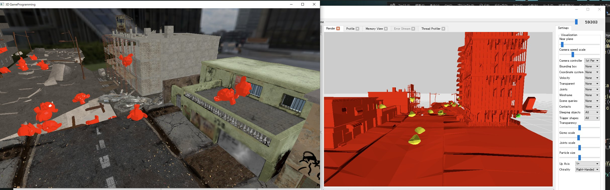
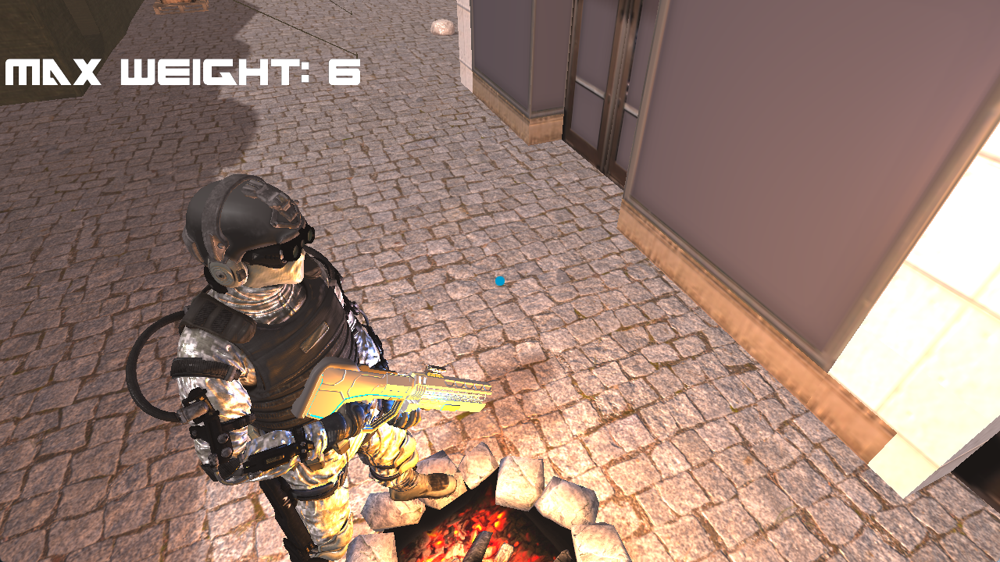
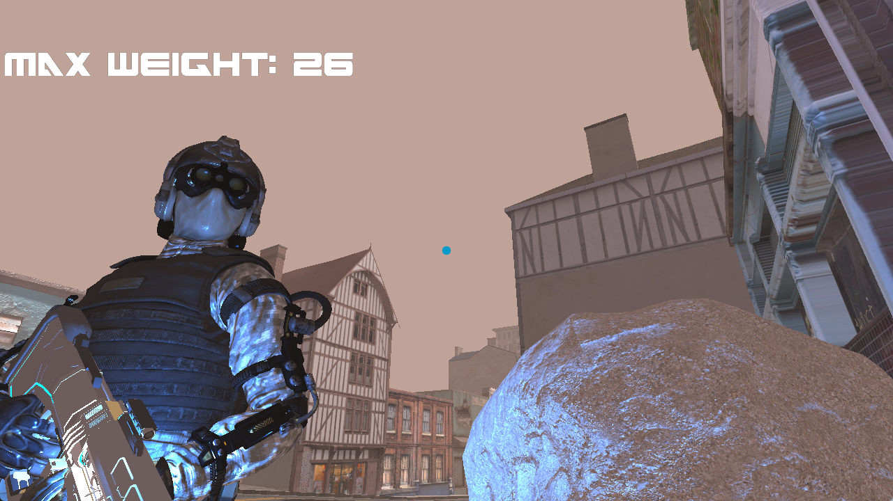
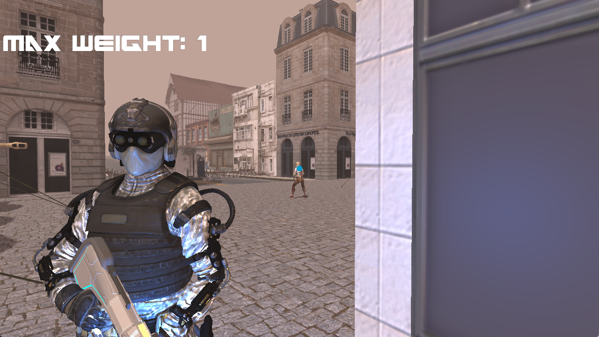

# All Your Weapons

ゾンビに支配され荒廃した世界で、モノが武器となり攻略していくゲーム

非公開

|          |                                    |
| -------- | ---------------------------------- |
| 開発環境     | C++17,DirectX11,Visual Studio 2022 |
| 開発人数     | 1人                                 |
| 開発期間     | 6ヶ月                                |
| プラットフォーム | Windows                            |
| 担当箇所     | 全て                                 |

## リアルな表現を再現するためのゲーム作り

### 物理エンジンの導入



物理エンジンをコアとしたゲームでしたが、同時にリアルな表現の再現にもつながりました。物理エンジンにはC++でコーディングされたPhysXを利用しました。その理由として、様々なタイトルでも実装されている実績があり、デバッグツールも利用可能であることからこちらを採用しました。

詳細はZennの記事で紹介しています。

[C++でPhysXを使ってみる](https://zenn.dev/kd_gamegikenblg/articles/cf925d2eb3c7aa)

### HLSLの実装



リアルな表現を実現するために、HLSLを利用して`PBR`や`Distance Fog`、`Depth Shadow`や`Skinning`も実装しました。



### 高品質Asset



プログラムの開発を優先するために、Assetはほとんど自作することなく外部のものを利用しました。ただ、ゲームで利用するには最適ではないAssetもあったため、Blenderやffmpegなどでポリゴン数の削減やTextureの解像度の削減なども行いました。また、通常のロード処理では700MB程あるAssetがSSDでも30秒ほどかかっていたのですが、Asset毎に`std::thread`をインスタンス化し並列にロードすることで、約5秒以内で完了するようになりました。またその作用として、止まることのないローディング画面も作成しました。

## 開発向上のための工夫

### Assetの管理

前述したとおり、Assetのロードは非同期で行いたかったのですが、その都度Assetクラスに実装するのは非効率なので、`std::thread`を利用する`Load`と必要なアクセサを実装したインターフェース`IAssetData`を作成し、それを継承し`Load`のみを実装するだけで非同期になるように実装しました。これで、3DModel以外の`Texture`や`json`なども簡単に非同期としてロードできるようになりました。

3DModelの処理の例

<details><summary>Click to show</summary>

内容を一部改変しています。

```cpp
#pragma once

#ifndef GAME_LIBRARIES_EXTERNALDEPENDENCIES_ASSET_IASSET_IASSETDATA_H_
#define GAME_LIBRARIES_EXTERNALDEPENDENCIES_ASSET_IASSET_IASSETDATA_H_

#include <memory>
#include <string>
#include <string_view>

#include "Thread/SimpleThreadManager/SimpleUniqueThread.h"


/**************************************************
*
* Interface for assets that support async loading
* using threads
*
**************************************************/
template<class AssetClass>
class IAssetData
{
public:

    using AssetClassT = typename AssetClass;

    IAssetData(std::string_view path)
        : m_isLoaded(false)
        , m_isFirstTimeLoaded(false)
        , m_isLoadedOnlyOnce(false)
        , m_filePath(path)
        , m_upAssetData(std::make_unique<AssetClass>())
    {}
    virtual ~IAssetData() {
        Release();
    }

    virtual bool Load() = 0;

    virtual void AsyncLoad(bool force = false) final {
        if (!m_thread.IsEnd()) return;
        if ((!m_thread.IsExists() && !m_isFirstTimeLoaded) || force) {
            m_thread.CreateAutoEnd(&IAssetData::Load, this);
        }
    }

    virtual bool IsLoaded() const noexcept final {
        return m_thread.IsExists() ? m_thread.IsEnd() : m_isLoaded;
    }

    virtual bool IsLoadSuccessed() const noexcept final {
        return m_isLoadSuccessed;
    }

    virtual bool IsLoadedOnlyOnce() noexcept final {
        if (IsLoaded() && !m_isLoadedOnlyOnce) {
            m_isLoadedOnlyOnce = true;
            return true;
        }
        return false;
    }

    virtual void LoadedOnlyOnceReset() noexcept final {
        m_isLoadedOnlyOnce = false;
    }

    virtual const std::string& GetFilePath() const noexcept final {
        return m_filePath;
    }

    const auto& GetData() const noexcept {
        return m_upAssetData;
    }

protected:

    template<class Func>
    bool LoadProcess(Func&& func) {
        m_isLoaded = false;
        m_isFirstTimeLoaded = true;

        m_isLoadSuccessed = func();

        m_isLoaded = true;

        return m_isLoadSuccessed;
    }

    void Release() {
        if (m_thread.IsExists()) {
            while (true) {
                if (m_thread.IsEnd()) break;
            }
        }
    }

    SimpleUniqueThread                m_thread;
    bool                              m_isLoaded          = false;
    bool                              m_isLoadSuccessed   = false;
    bool                              m_isFirstTimeLoaded = false;
    bool                              m_isLoadedOnlyOnce  = false;

    const std::string                 m_filePath;
    const std::unique_ptr<AssetClass> m_upAssetData       = nullptr;

};

#endif
```

```cpp
#pragma once

#include <ExternalDependencies/Asset/IAsset/IAssetData.h>

class ModelData : public IAssetData<Model>
{
public:

  ModelData(std::string_view path)
    : IAssetData(path)
  {}
  ~ModelData() override {
    Release();
  }

  bool Load() override {
    const bool successed = LoadProcess([&] {
      return m_upAssetData->Load(m_filePath);
    });
    if (successed) {
      m_spModel = std::make_shared<ModelWork>();
      m_spModel->SetModel(std::make_shared<Model>(*m_upAssetData));
    }
    return successed;
  }

  const std::shared_ptr<ModelWork> GetOriginalData() const {
    return m_spModel;
  }

private:

  void Release() {}

  std::shared_ptr<ModelWork> m_spModel = nullptr;

};
```

</details>

また、Assetを複数インスタンス化するためのAssetManagerも実装しました。

詳細はZennの記事で紹介しています。

[C++でゲーム用AssetManagerの設計を考えてみる](https://zenn.dev/kd_gamegikenblg/articles/4b92892d8d89c5)

### パラメータを外部から変更する

C++では標準で`json`のライブラリはないので、外部の`nlohmann/json`を利用して、パラメータを外部から変更できるようにしました。

jsonでオブジェクトを定義する例

<details><summary>Click to show</summary>

```json
{
  "schema": "default",
  "transform": {
    "position": [0, 0.15, 1],
    "rotation": [0, 0, 0],
    "scale": 0.2,
    "fixed": true
  },
  "collision": {
    "physx": {
      "type": "static",
      "shapes": [
        {
          "mesh": {}
        }
      ]
    },
    "passive": [
      {
        "mesh": {
          "default_collision_type": [
            "bump"
          ]
        }
      }
    ]
  },
  "model": {
    "path": "Asset/Model/camp_fire/camp_fire.gltf"
  }
}
```

</details>

また、このプロジェクトではjson-validatorを利用して、jsonの設定ミスによるassertをより分かりやすく表示できるようにしています。

詳細はZennの記事で紹介しています。

[C++でjsonのschemaを使ったvalidationをする](https://zenn.dev/kd_gamegikenblg/articles/98cf3004c4c46f)
