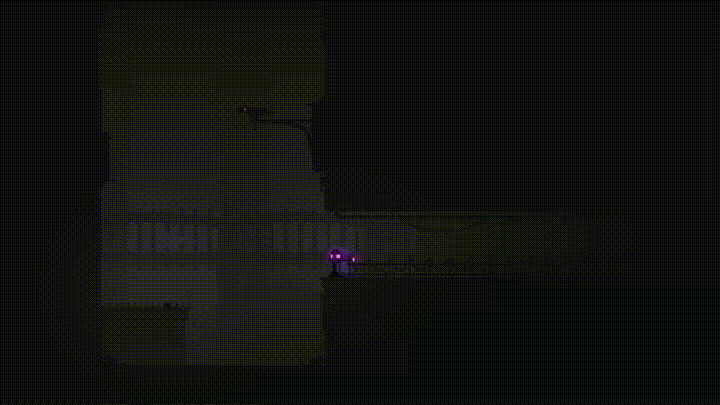

# Noctem

ダークファンタジー風の爽快アクションゲーム

<iframe width="560" height="315" src="https://www.youtube.com/embed/wE0gTCZ1qj8?si=vhCACjR5PUpRQLj0" title="YouTube video player" frameborder="0" allow="accelerometer; autoplay; clipboard-write; encrypted-media; gyroscope; picture-in-picture; web-share" referrerpolicy="strict-origin-when-cross-origin" allowfullscreen></iframe>

<iframe width="552" height="167" frameborder="0" src="https://itch.io/embed/1470243"><a href="https://kobedenshigame.itch.io/noctem">Noctem by 神戸電子ゲームソフト分野</a></iframe>

|          |                                    |
| -------- | ---------------------------------- |
| 開発環境     | C++14,DirectX11,Visual Studio 2019 |
| 開発人数     | 4人                                 |
| 開発期間     | 4ヵ月                                |
| プラットフォーム | Windows                            |
| 担当箇所     | 進行管理,UI全般,疑似3D,各種ライブラリ作成           |

## 疑似3D

当時、DirectXで3Dを表現する知見がなかったため、塔を登って攻略していくという世界観を実現するために、2D表現を駆使し疑似的に3Dに見えるよう工夫しました。

## 各種ライブラリ作成

初めてのチーム制作だったため、リソース管理が煩雑になりつつありました。そこで、テクスチャやサウンドなどのリソースを管理するマネージャークラスを作成し、リソース追加時の手順を効率化しました。

また、C++特有のメモリ管理や汎用性のある計算式などをユーティリティークラスとして作成し、開発効率を向上させました。

さらに、ゲームを一般公開するにあたりキーコンフィグやセーブデータの暗号化ライブラリの作成なども手がけました。
