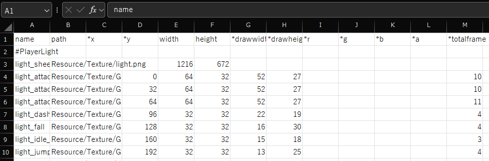
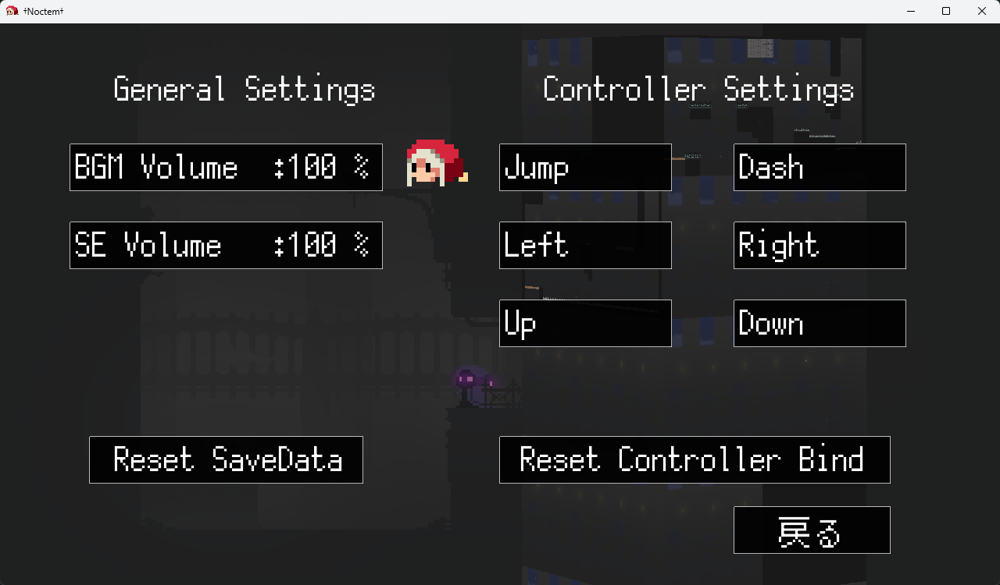

# Noctem

ダークファンタジー風の爽快アクションゲーム

<iframe width="560" height="315" src="https://www.youtube.com/embed/wE0gTCZ1qj8?si=vhCACjR5PUpRQLj0" title="YouTube video player" frameborder="0" allow="accelerometer; autoplay; clipboard-write; encrypted-media; gyroscope; picture-in-picture; web-share" referrerpolicy="strict-origin-when-cross-origin" allowfullscreen></iframe>

<iframe width="552" height="167" frameborder="0" src="https://itch.io/embed/1470243"><a href="https://kobedenshigame.itch.io/noctem">Noctem by 神戸電子ゲームソフト分野</a></iframe>

|          |                                    |
| -------- | ---------------------------------- |
| 開発環境     | C++14,DirectX11,Visual Studio 2019 |
| 開発人数     | 4人(Programmer:4人)                  |
| 開発期間     | 約4ヵ月                               |
| プラットフォーム | Windows                            |
| 担当箇所     | 進行管理,UI全般,疑似3D,各種ライブラリ作成           |

## 疑似3D

当時、DirectXで3Dを表現する知見がなかったため、塔を登って攻略していくという世界観を実現するために、2D表現を駆使し疑似的に3Dに見えるよう工夫しました。


## 各種ライブラリ作成

初めてのチーム制作だったため、リソース管理が煩雑になりつつありました。そこで、テクスチャやサウンドなどのリソースを管理するマネージャークラスを作成し、リソース追加時の手順を効率化しました。



この作品では編集のし易さを考慮しCSVとExcelを利用して追加していました。

また、C++特有のメモリ管理や汎用性のある計算式などをユーティリティークラスとして作成し、開発効率を向上させました。

<details><summary>Click to show</summary>

内容を一部抜粋、改変しています。

```cpp
// Utilityクラス

template<class T, class U>
bool CheckVector(const T& _vector, const U& _begin) {
  return std::is_same<std::vector<U>, T>::value;
};
template<class T, class U>
bool CheckList(const T& _list, const U& _begin) {
  return std::is_same<std::list<U>, T>::value;
};
template<class T>
bool CheckPointer(const T& _arg) {
  return std::is_pointer<T>::value;
}

template<class T>
inline void Delete(T*& _arg) {
  if (!_arg) return;
  delete _arg;
  _arg = nullptr;
}

template<class T>
inline void LoopDelete(T& _arg) {
  if (CheckPointer(*_arg.begin())) {
    for (auto list : _arg) Delete(list);
  }
  _arg.clear();
}

template<class T>
void AutoDelete(T& _arg) {
  if (_arg.size() == 0) return;
  if (CheckVector(_arg, *_arg.begin())) {
    LoopDelete(_arg);
    _arg.shrink_to_fit();
    if (_arg.capacity() != 0) {
      _RPT0(_CRT_WARN, "It may not have been released properly.\n");
      _RPTN(_CRT_WARN, "CAPACITY: %d\n", _arg.capacity());
    }
    return;
  };
  if (CheckList(_arg, *_arg.begin())) {
    LoopDelete(_arg);
    return;
  }
};

template<class T>
void AutoDelete(T*& _pArg)
{
  if (_pArg->size() == 0) return;
  if (CheckVector(*_pArg, *(*_pArg).begin())) {
    LoopDelete(*_pArg);
    _pArg->shrink_to_fit();
    if (_pArg->capacity() != 0) {
      _RPT0(_CRT_WARN, "It may not have been released properly.\n");
      _RPTN(_CRT_WARN, "CAPACITY: %d\n", _pArg->capacity());
    }
    Delete(_pArg);
    return;
  };
  if (CheckList(*_pArg, *(*_pArg).begin())) {
    LoopDelete(*_pArg);
    Delete(_pArg);
    return;
  }
  return;
};

template<class T, class... U>
inline void DeleteList(T& _arg, U&... _args) {
  AutoDelete(_arg);
  DeleteList(std::forward<U>(_args)...);
};

inline void DeleteList() {};
```

</details>

さらに、ゲームを一般公開するにあたりキーコンフィグやセーブデータの暗号化ライブラリの作成なども手がけました。


