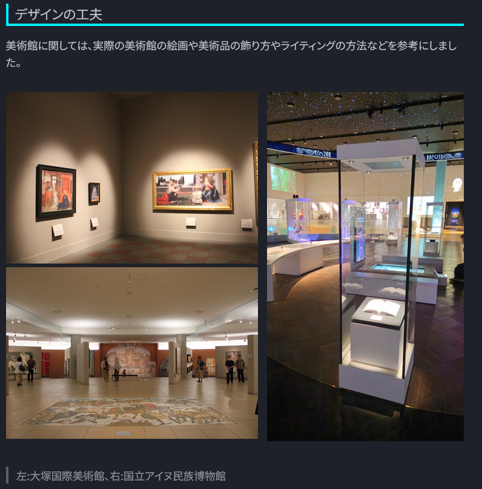
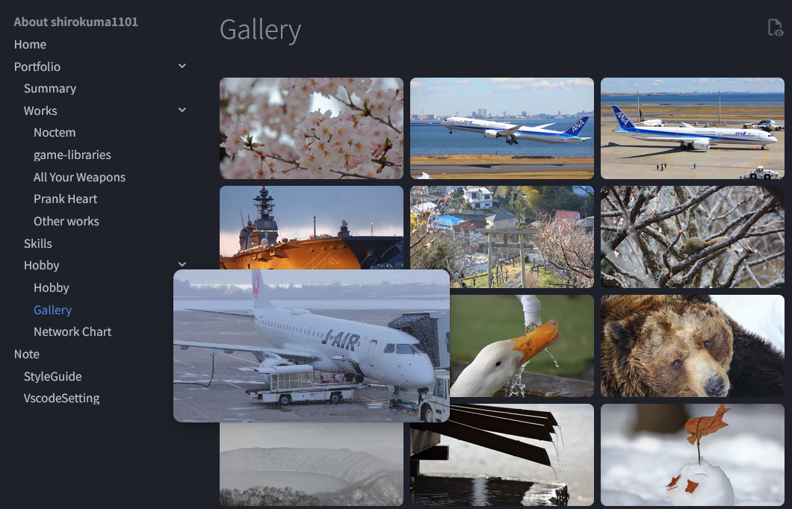
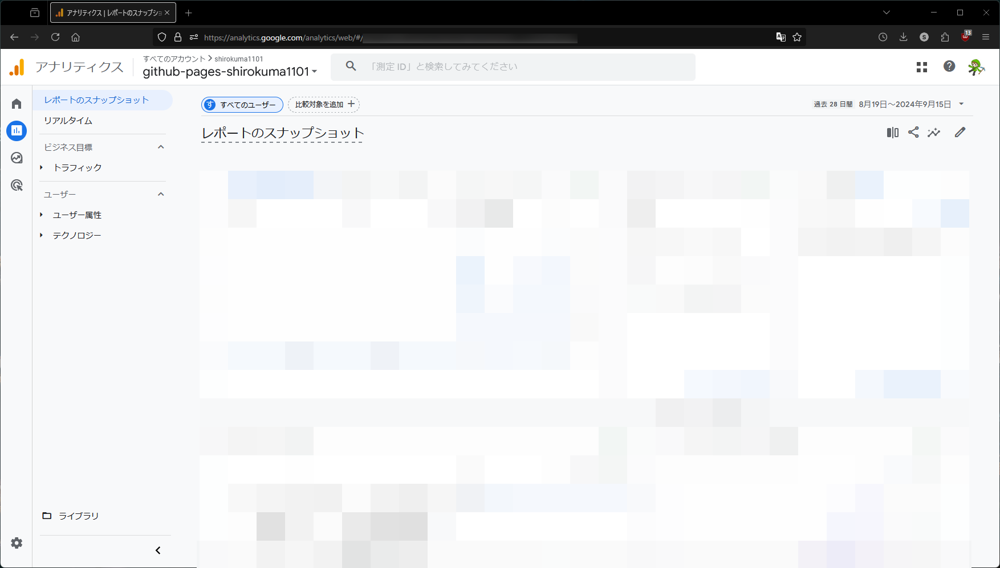

# Other Works

## C\#

### Netcode for GameObjects 1.5.1 based extended version

当時のNGOでは複数のバグや仕様に悩まされていたため、Forkしてカスタムすることにしました。

[Netcode for GameObjects 1.5.1 based extended version](https://github.com/shirokuma1101/com.unity.netcode.gameobjects)

また、BroadcastRpc(Host/Clientから全てのHost/ClientのRPCを呼び出す属性)を実装するにあたり、Mono.Cecilを利用したILPostProcessorを利用し実装しました。

詳細はZennの記事で紹介しています。

[C#のMono.Cecil(自分が)入門](https://zenn.dev/kd_gamegikenblg/articles/e4cefb3b49f0e3)

### unity-ngo-manager

NGOで実装するにあたり、Host/Clientの処理を`Start`や`Update`に記述しているため、メソッドの中身が肥大化していきました。`partial`で実装することも考えましたが、今回は`ngo-manager`というライブラリを作成し、それぞれ`OnHostStart`や`OnClientUpdate`のようなイベント関数のように呼び出せるように実装しました。また全ての`Network Object`はここで管理するようにしています。

[unity-ngo-manager](https://github.com/shirokuma1101/unity-ngo-manager)

## Python

### Portfolio

このWebページはmkdocsを利用して生成しています。

"見やすい"ページを作成するにあたり、見た目のカスタマイズが柔軟に可能である`CSS`や`HTML`を利用できる環境であり、かつ本文自体は簡単に記述できる`Markdown`形式である点からこちらを採択しました。

  
  { .card loading=lazy }

  
  { .card loading=lazy }

このページでもヘッダーや画像の表示部分にいくつかCSSを利用しています。

また、このページは`GitHub Actions`と`GitHub Pages`を利用して継続的にデプロイまで行っています。

ほかにも、`Google Analytics`を利用して訪問者の統計も可視化できるようにしています。

