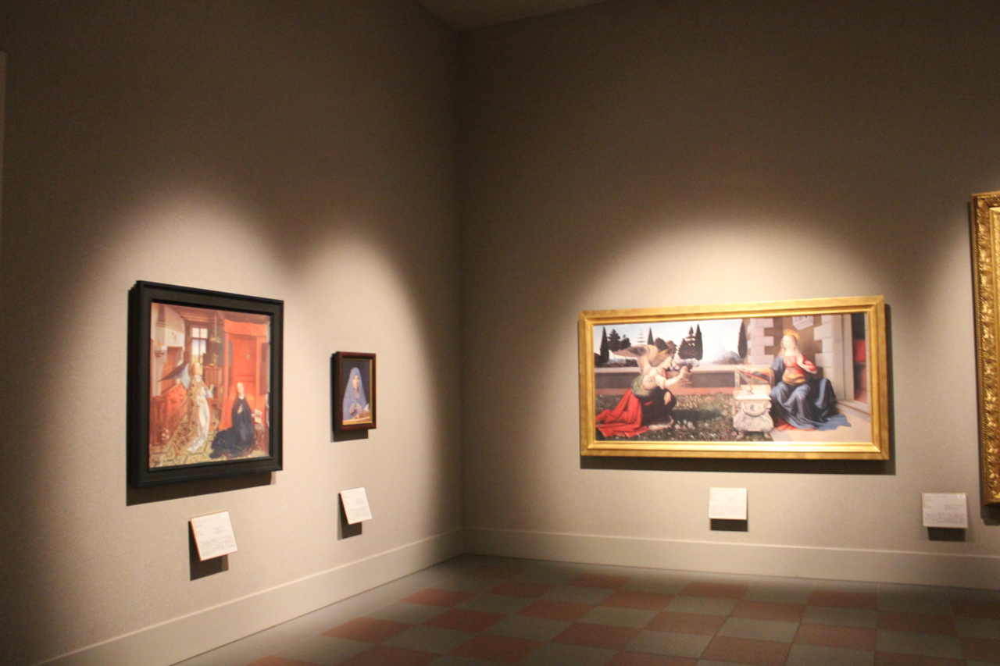

# Prank Heart

怪盗 vs 探偵のドタバタオンライン対戦アクションゲーム

<iframe width="560" height="315" src="https://www.youtube.com/embed/EpqwGB1X9M4?si=JnbtWzS4yWzkmQ2n" title="YouTube video player" frameborder="0" allow="accelerometer; autoplay; clipboard-write; encrypted-media; gyroscope; picture-in-picture; web-share" referrerpolicy="strict-origin-when-cross-origin" allowfullscreen></iframe>

<iframe src="https://store.steampowered.com/widget/2654360/" frameborder="0" width="646" height="190"></iframe>

|          |                                     |
| -------- | ----------------------------------- |
| 開発環境     | Unity 2022.3,Visual Studio 2022     |
| 開発人数     | 7人(Programmer:6人,Help:1人)           |
| 開発期間     | 約1年                                 |
| プラットフォーム | Windows,Steam Deck                  |
| 担当箇所     | ネットワーク全般,ビルドシステム作成,ステージ作成,各種ライブラリ作成 |

## ネットワーク全般

詳細はZennの記事で紹介しています。

[UnityのNetcode for GameObjectsでマルチプレイヤーゲームを開発したときの話](https://zenn.dev/kd_gamegikenblg/articles/eeb76c3996fef3)

## ビルドシステム作成

詳細はZennの記事で紹介しています。

[Jenkins+PythonでUnityの自動ビルド&自動デプロイ](https://zenn.dev/kd_gamegikenblg/articles/c8b89f317d9cee)

## ステージ作成

私たちのチームはプログラマーのみで構成されていたため、デザイナーやプランナーの役割が必要でした。

そこでステージ制作では、背景に関してはUnrealEngineで無料配布される高品質Assetを活用し、レベルデザインに関しては現実の美術館を参考に作成しました。

### デザインの工夫

美術館に関しては、実際の美術館の絵画や美術品の飾り方やライティングの方法などを参考にしました。

<div class="image-container" markdown>
  <div class="left-column" markdown>

  
  

  </div>
  <div class="right-column" markdown>

  

  </div>
</div>

> 左:大塚国際美術館、右:国立アイヌ民族博物館


> Lighting例

また、一部絵画やショーケース内のモデルは、私や友人が撮影した風景画像や神戸電子専門学校でリリースされたゲームの画像やモデルを許諾を得たうえで利用しています。


## 各種ライブラリ作成

開発期間が1年程と私の経験したことのない規模での開発であったため、当初からライブラリ化するものを選定していました。私は主にアウトゲーム担当だったので、ライブラリ作成に多く携わりました。

### ネットワーク関連

ネットワークライブラリについては、`Netcode for GameObjects`を採用しました。ただ、今回制作するにあたって使いにくい部分があったため、Forkしてカスタムしたものを利用しています。

詳細は別のページで紹介しています。

[Netcode for GameObjects 1.5.1 based extended version](./otherworks.md#netcode-for-gameobjects-151-based-extended-version)

また、NetworkObjectの管理を簡単にするために管理ライブラリも作成しました。

詳細は別のページで紹介しています。

[unity-ngo-manager](./otherworks.md#unity-ngo-manager)

MatchMakingについては主にUnity公式サンプルを参考にしました。

[Boss Room: a Co-op, Multiplayer RPG Sample](https://github.com/Unity-Technologies/com.unity.multiplayer.samples.coop)

また、ネットワークを実現するにあたって重要なMatchMakingシステムを様々なPlatformに対応できるように抽象化クラスを作成しました。

<details><summary>Click to show</summary>

内容を一部抜粋、改変しています。

```cs
/// <summary>
/// An abstract class that summarizes common processing when implementing lobbies
/// Since MonoBehaviour is inherited, it can be inherited as it is.
/// </summary>
[Serializable]
public abstract class LobbyBase : SingletonNetworkPersistent<LobbyBase>
{
  /// <summary>
  /// Payload used when connecting to the host.
  /// </summary>
  [Serializable]
  public class Payloads
  {
    public string version;
    public string password;
  }

  /// <summary>
  /// Lobby data to be displayed in the lobby list.
  /// </summary>
  [Serializable]
  public class LobbyData
  {
    public string name;
    public bool hasPassword;
    public int currentMembers;
    public int maxMembers;
  }

  /// <summary>
  /// Minimum and maximum number of members in the lobby.
  /// </summary>
  public const int MIN_MEMBERS = 2;
  public const int MAX_MEMBERS = 10;

  /// <summary>
  /// Max number of members in the lobby.
  /// (Can only be set by the host.)
  /// (It will not be an error if the client sets it, but it will be ignored.)
  /// </summary>
  /// <exception cref="ArgumentOutOfRangeException">
  /// Throws an "ArgumentOutOfRangeException" if the number is set to less than the number of clients already connected.
  /// Also, values less than MIN_MEMBERS or greater than MAX_MEMBERS are clamped.
  /// </exception>
  public virtual int MaxMembers
  {
    get => maxMembers;
    set
    {
      if (IsHost)
      {
        if (NetworkManager.Singleton.ConnectedClients.Count > value)
        {
          throw new ArgumentOutOfRangeException(nameof(maxMembers), "MaxMembers must be greater than the number of connected clients.");
        }
      }
      maxMembers = ClampMaxMembers(value);
    }
  }

  /// <summary>
  /// Payload used when connecting to the host.
  /// </summary>
  public Payloads Payload { get; set; }
  /// <summary>
  /// Disconnect scene to be loaded when disconnected from the host.
  /// </summary>
  public LoadingSceneManager.SceneName DisconnectScene { get; set; } = LoadingSceneManager.SceneName.Title;
  /// <summary>
  /// Disconnect reason to be displayed when disconnected from the host.
  /// </summary>
  public string DisconnectReason { get; set; } = "Disconnected from the host.";

  /// <summary>
  /// Is already set up.
  /// </summary>
  public bool IsSetUp { get; private set; } = false;

  /// <summary>
  /// Stores lobby search results.
  /// </summary>
  public List<LobbyData> LobbyList { get; } = new();

  private int maxMembers = MIN_MEMBERS;

  /// <summary>
  /// Clamp the number of members to the minimum and maximum values.
  /// </summary>
  /// <param name="members"></param>
  /// <returns></returns>
  public static int ClampMaxMembers(int members)
    => Mathf.Clamp(members, MIN_MEMBERS, MAX_MEMBERS);


  //==================================================
  // 1. For host, it must be called first.
  //==================================================

  public virtual bool Setup(bool isApproval, Payloads payload)
  {
    if (IsSetUp)
    {
      throw new InvalidOperationException("Already set up.");
    }

    try
    {
      using var CheckInternet = new WebClient();
      using (CheckInternet.OpenRead("http://clients3.google.com/generate_204")) { }
    }
    catch
    {
      DisconnectReason = "No internet connection.";
      DisconnectScene = LoadingSceneManager.SceneName.Title;
      DisconnectAsync(NetworkManager.Singleton.LocalClientId).Forget();

      return false;
    }

    Payload = payload;

    NetworkManager.Singleton.NetworkConfig.ConnectionData = Encoding.UTF8.GetBytes(JsonUtility.ToJson(Payload));
    NetworkManager.Singleton.OnClientDisconnectCallback += OnClientDisconnect;
    NetworkObjectManager.Instance.Initialize();

    if (isApproval)
    {
      NetworkManager.Singleton.ConnectionApprovalCallback += ApprovalCheck;
    }

    IsSetUp = true;
    return true;
  }

  //==================================================
  // 2.Then call.
  //==================================================

  public abstract UniTask<bool> CreateLobbyAsync();
  public abstract UniTask<bool> JoinLobbyAsync();
  public abstract UniTask<bool> LeaveLobbyAsync();
  public abstract UniTask<bool> SearchLobbyAsync();

  protected virtual bool StartHost()
    => NetworkManager.Singleton.StartHost();
  protected virtual bool StartClient()
    => NetworkManager.Singleton.StartClient();

  //==================================================
  // 3. End processing.
  //==================================================

  public async virtual UniTask DisconnectAsync(ulong clientId, bool returnToTitle = true)
  {
    if (clientId == NetworkManager.Singleton.LocalClientId)
    {
      IsSetUp = false;

      NetworkObjectManager.Instance.Shutdown();
      NetworkManager.Singleton.Shutdown(true);

      // Wait for the shutdown to complete
      await UniTask.WaitUntil(() => NetworkManager.Singleton.ShutdownInProgress == false);

      if (returnToTitle)
      {
        LoadingSceneManager.Instance.LoadSceneAsync(DisconnectScene, LoadSceneMode.Single, false).Forget();
      }
    }
    else
    {
      DisconnectClientServerRpc(clientId);
    }
  }
}
```

</details>

### Steamでリリースするにあたっての作業


Steamでのリリースに向けて`Steam MatchMaking`を利用したマッチメイキングや実績、統計を実装しました。データ上の扱いが基本だったので、`UnityEditor`の拡張を利用して可視化しデバッグしやすい画面を作成しました。

### アイテムやAI用ノードポイント

`ScriptableObject`を利用してアイテムの情報やAI用ノードポイントをパラメータとして簡単に設定できるシステムも作成しました。


宝箱に関して、Prefabに設定するだけで宝箱の価値やRePop時間を変更できるようにしました。

また、`ScriptableObject`を利用してAI用ノードポイントをSceneView上で扱いやすくするEditor拡張もチームメンバーが紹介しています。

[[Unity]Vector3やEnumをSceneView上で編集できるようにする](https://zenn.dev/kd_gamegikenblg/articles/30b2b1139b213c)
